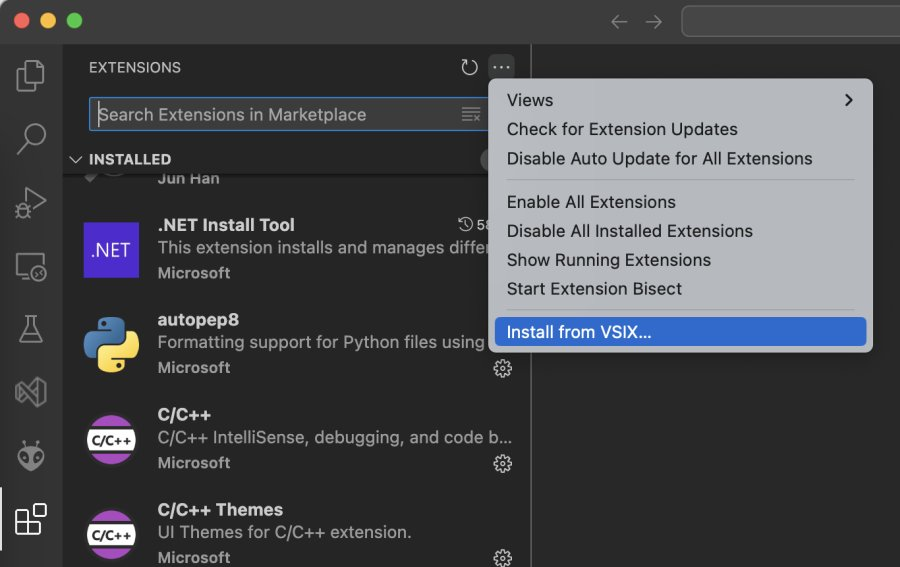

# Anode live coding extension for VS Code

This simple extension lets you press Ctrl+Enter (or Cmd+Enter) inside a Javascript file to send the lines under the cursor to a live sketch running in a browser. It was inspired by the [vscode-tidalcycles](https://github.com/tidalcycles/vscode-tidalcycles) extension, but is a lot simpler.

It sends changes as a POST request to a relay server that you can run locally. The server sends the changes to the browser-based sketch, which is connected over a Web Socket.

The extension looks for the nearest empty lines before and after the cursor, and sends the part between them as the "section" of code to be executed in the running sketch.

You can add the extension manually by clicking the "..." to the right of "Extensions" at the top and browsing to the .vsix file.

After installing, go to Settings, look for the "Anode" section, and enter the URL of your relay server.




## Sample relay server

This is the NodeJS relay server that I use:

```javascript
import express from "express";
import bodyParser from 'body-parser';
import cors from "cors";
import * as http from "http";
import { WebSocketServer } from "ws";

const kSocketPath = "/relay"
const listenerSockets = [];
let lastContent = null;
let lastTimestamp = null;

// This is the entry point: starts server
export async function runRelay(port) {

  // Create app, server, web socket servers
  const app = express();
  app.use(cors());
  app.use(bodyParser.json());
  const server = http.createServer(app);
  const socketServer = new WebSocketServer({ noServer: true });

  app.get("/", getRoot);
  app.post("/", postRoot);

  // Upgrade connections to web socker
  server.on("upgrade", (request, socket, head) => {
    if (request.url === kSocketPath) {
      socketServer.handleUpgrade(request, socket, head, (ws) => {
        socketServer.emit("connection", ws, request);
      });
    }
    else {
      socket.destroy(); // Close the connection for other paths
    }
  });

  socketServer.on("connection", (ws) => {
    console.log("Relay> Client connected");
    listenerSockets.push(ws);
    ws.on("close", () => {
      console.log("Relay> Client disconnected");
      const ix = listenerSockets.indexOf(ws);
      if (ix != -1) listenerSockets.splice(ix, 1);
    });
  });

  // Run
  try {
    await listen(server, port);
    console.log(`Relay server is listening on port ${port}`);
  }
  catch (err) {
    console.error(`Relay server failed to start; error:\n${err}`);
  }
}

function listen(server, port) {
  return new Promise((resolve, reject) => {
    server.listen(port)
      .once('listening', resolve)
      .once('error', reject);
  });
}

const sep = "==========================================================================\n";

function getRoot(req, response) {
  let respText = "";
  if (lastContent !== null) {
    respText += sep;
    respText += lastTimestamp + "\n";
    respText += sep;
    respText += lastContent + "\n";
    respText += sep;
  }
  respText += "Relay ready\n";
  response.set('Content-Type', 'text/plain; charset=utf-8');
  response.status(200).send(respText);
}

function truncate(str) {
  const newline = str.indexOf('\n');
  const end = newline >= 0 && newline < 32 ? newline : 32;
  let res = str.slice(0, end);
  if (res.length < str.length) res += " [...]";
  return res;
}

function postRoot(req, response) {
  const digest = truncate(req.body.command);
  console.log(`Relay> Command posted: ${digest}`);
  lastTimestamp = new Date().toISOString();
  lastContent = req.body.command;
  for (const sck of listenerSockets) sck.send(lastContent);
  response.status(200).send("OK");
}

void runRelay(8081);
```

## Listening in a sketch

This is how you can listen to changes in your live sketch.

### receiver.js

```javascript
const relaySocketUrl = "ws://localhost:8081/relay";

function truncate(str) {
  const newline = str.indexOf('\n');
  const end = newline >= 0 && newline < 32 ? newline : 32;
  let res = str.slice(0, end);
  if (res.length < str.length) res += " [...]";
  return res;
}

export function initReceiver(onCommand) {

  let state = 0;
  let socket = null;

  const connectSocket = () => {
    if (state == 1) return;
    console.log("Receiver socket: connecting...");
    state = 1;
    socket = new WebSocket(relaySocketUrl);
    socket.addEventListener("open", () => {
      state = 2;
      console.log("Receiver socket open");
    });
    socket.addEventListener("message", (event) => {
      const msgStr = event.data;
      console.log(`Receiver message: ${truncate(msgStr, 64).replaceAll("\n", " ")}`);
      if (onCommand) onCommand(msgStr);
    });
    socket.addEventListener("close", () => {
      state = 0;
      console.log("Receiver socket closed");
      setTimeout(() => connectSocket(), 1000);
    });
  }

  setInterval(() => {
    if (socket != null && state == 2) socket.send("ping");
  }, 5000);

  connectSocket();
}
```

### sketch.js

```javascript
initReceiver(runCommand);

frame();

function frame(msec) {
  // Paint current frame on screen
  // ...
  
  // Request next callback
  requestAnimationFrame(frame);
}

const commandContext = {
  setBackgroundColor: function(value) {
    // Set background color for use in frame()
  },
};

function runCommand(cmd) {
  const evalCommand = new Function('ctxt', `with(ctxt) { ${cmd}; }`);
  evalCommand(commandContext);
}
```

## Building

To build the extension after cloning the repository:

```
yarn
node build.js
```

The .vsix file will be placed in `dist`.
